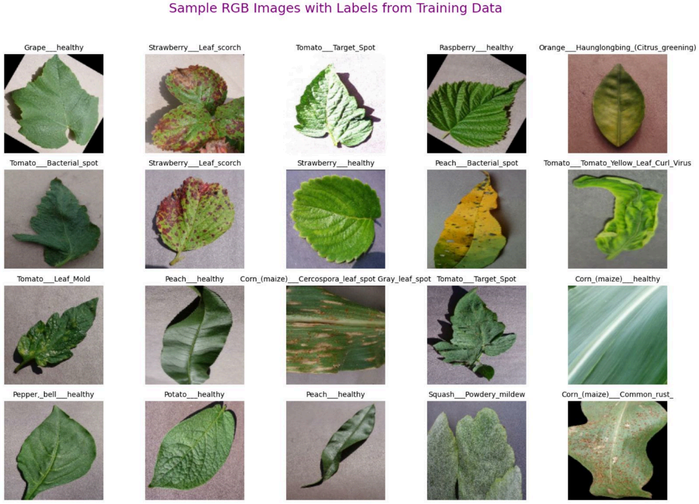
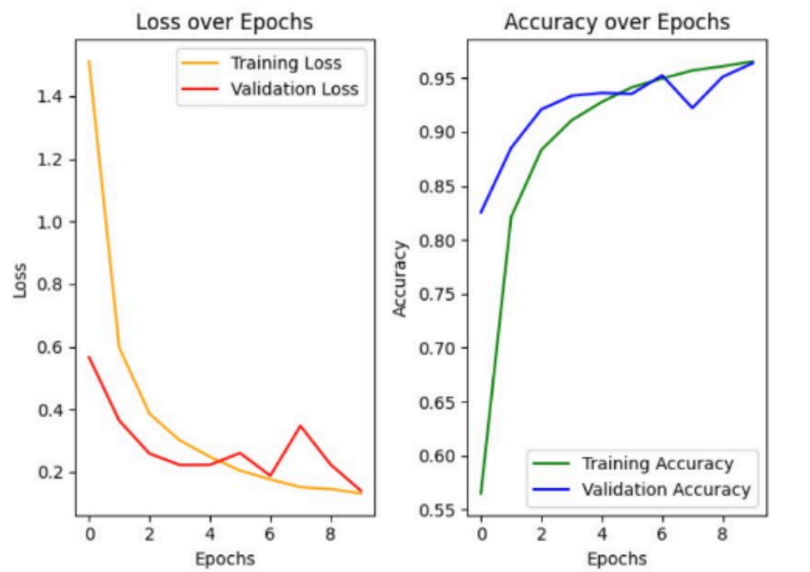
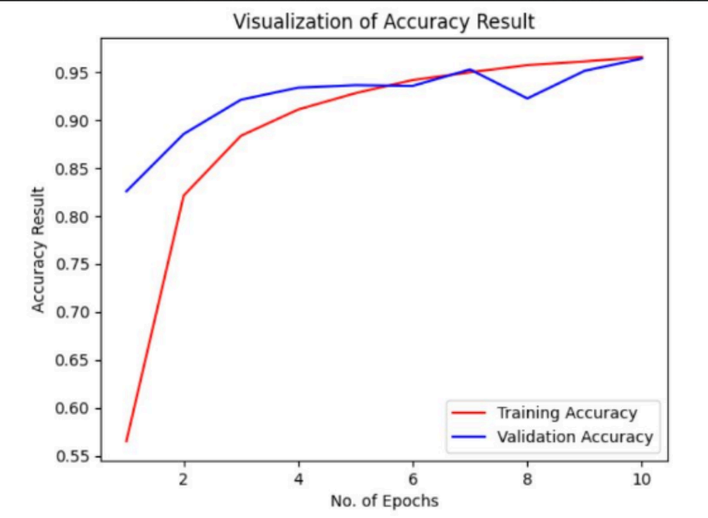
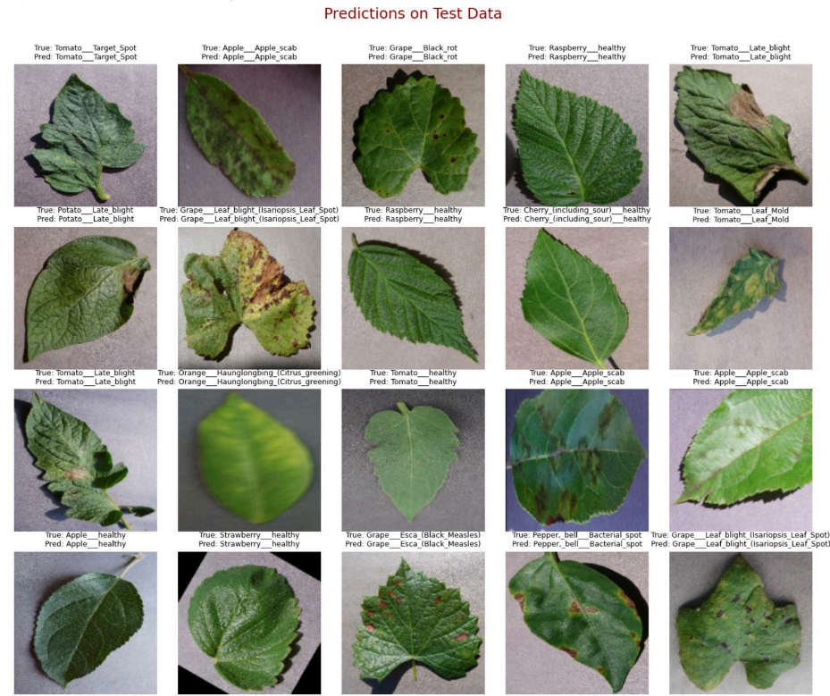

# 🌿 Plant Disease Detection using CNN

---

## 📜 Table of Contents

1. [Introduction](#📌-introduction)
2. [Motivation & Objectives](#🎯-motivation--objectives)
3. [Literature Review / Background](#🧠-literature-review--background)
4. [Problem Statement](#🧩-problem-statement)
5. [Methodology](#🧮-methodology)
6. [Implementation and Results](#📊-implementation-and-results)
7. [Discussion](#🧵-discussion)
8. [Conclusion & Future Work](#✅-conclusion--future-work)
9. [References](#📚-references)
10. [Appendix](#📎-appendix)
11. [Live Demo](#🌐-live-demo)
12. [Author](#👨‍💻-author)

---

## 📌 Introduction

In modern agriculture, **early identification of plant diseases** is vital for ensuring food security and reducing crop loss. Traditional manual inspection is not scalable and often prone to human error.

To overcome this, we employ **Convolutional Neural Networks (CNNs)** for automated disease detection using leaf images.

This project demonstrates how supervised deep learning can be applied to real-world agricultural problems, laying the foundation for **smart farming applications**.

---

## 🎯 Motivation & Objectives

### 🚀 Motivation

Early detection can reduce yield loss significantly and help initiate timely treatment. Deep learning enables **automated, real-time, and high-accuracy disease detection**.

### ✅ Objectives

* Design and train a CNN to classify plant diseases using leaf images.
* Evaluate model accuracy on unseen data.
* Deploy the trained model as an interactive web app.

---

## 🧠 Literature Review / Background

### 🔍 CNN Overview

* **Convolutional Layers** – Extract features like edges, textures.
* **ReLU Activation** – Adds non-linearity.
* **Pooling Layers** – Reduce computation and retain patterns.
* **Dropout Layers** – Prevent overfitting.
* **Dense + Softmax** – Classify into final categories.

### 🔬 Related Work

CNNs like **VGGNet**, **AlexNet**, and **ResNet** have achieved >98% accuracy on datasets like **PlantVillage**.

> **Tools Used:** TensorFlow, Keras, NumPy, Matplotlib, Seaborn, OpenCV

---

## 🧩 Problem Statement

Manual plant disease detection is:

* Time-consuming,
* Requires experts,
* Not feasible for large-scale farms.

This project aims to develop an **automated disease classification system** using plant leaf images.

---

## 🧮 Methodology

### 🔧 Algorithm

* **Convolutional Neural Network (CNN)**
* Supervised learning on labeled RGB leaf images.

### 🧱 Model Architecture

| Layer       | Details                                |
| ----------- | -------------------------------------- |
| Input       | 128×128×3                              |
| Conv + Pool | Multiple layers with ReLU + MaxPooling |
| Dropout     | To prevent overfitting                 |
| Flatten     | 2D → 1D                                |
| Dense       | Fully connected layers                 |
| Output      | Softmax over 38 classes                |

---

### 🗃️ Data Loading

Using `image_dataset_from_directory()` in TensorFlow for:

* Preprocessing
* Augmentation
* Train-validation split (80/20)

---

### 📉 Loss & Optimization

* **Loss**: Categorical Crossentropy
* **Optimizer**: Adam
* **Evaluation Metric**: Accuracy

---

## 📊 Implementation and Results

### 🗂️ Dataset

| Attribute    | Description                                                      |
| ------------ | ---------------------------------------------------------------- |
| Source       | [Mendeley Data](https://data.mendeley.com/datasets/tywbtsjrjv/1) |
| Total Images | \~87,000                                                         |
| Image Format | JPEG/PNG                                                         |
| Classes      | 38 (Healthy + Diseased)                                          |
| Image Size   | Resized to 128x128                                               |

> 🖼️ **Figure 1: Sample Images from Dataset**

---

### 🔁 Augmentation Techniques

* Flipping (H/V)
* Gamma Correction
* PCA Color Jitter
* Noise Injection
* Rotation + Scaling

> 🖼️ **Figure 2: CNN Model Training Snapshot**

---

### 📦 Data Split

* Train: 80%
* Validation: 20%
* Test: 33 Unseen Images

---

### 🧠 Training Summary

> 📘 Code: [`Train_plant_disease.ipynb`](Train_plant_disease.ipynb)

* Loaded and resized images
* Defined model architecture
* Trained over several epochs
* Saved model as `.keras` file

---

### 🧪 Testing Summary

> 📘 Code: [`Test_Plant_Disease.ipynb`](Test_Plant_Disease.ipynb)

* Used OpenCV for custom image testing
* Predicted labels using saved model

---

### 📈 Training Graphs

> 🖼️ **Figure 4: Training vs Validation Loss**

> 🖼️ **Figure 5: Training vs Validation Accuracy**

> 🖼️ **Figure 8: Predictions on Test Set**

---

## 🧵 Discussion

### ✅ Insights

* CNN successfully learned leaf disease features.
* Simple CNN showed great results due to dataset quality and augmentation.

### ⚠️ Bottlenecks

* Imbalance in class samples.
* Some test images had cluttered backgrounds.
* More advanced models could yield even better results.

---

## ✅ Conclusion & Future Work

### 🔚 Conclusion

CNNs were effectively used for classifying 38 plant disease categories from leaf images.

### 🔮 Future Work

* Try advanced architectures like ResNet/MobileNet
* Deploy as a mobile/web app for farmer access
* Add more real-world noisy image testing

---

## 📚 References

* [TensorFlow](https://www.tensorflow.org/)
* [Keras](https://keras.io/)
* [OpenCV](https://docs.opencv.org/)
* [Mendeley Plant Disease Dataset](https://data.mendeley.com/datasets/tywbtsjrjv/1)

---

## 📎 Appendix

### Code Files

* `Train_plant_disease.ipynb` – Model Training
* `Test_Plant_Disease.ipynb` – Model Testing
* `main.py` – Streamlit Frontend
* `trained_model.keras` – Final model

---

## 🌐 Live Demo

> ✅ Visit the live app here:
> [🌿 Plant Disease Detection Web App](https://plant-disease-detection-app-tzwc.onrender.com/)

### 🔧 Deployment Details

* **Frontend:** Built using Streamlit (`main.py`)
* **Model:** Pre-trained Keras CNN model (`trained_model.keras`)
* **Hosting:** Render.com (Free Tier)
* **Runtime:** Python 3.10
* **Port:** 8501 (auto-detected by Streamlit)

**Upload any plant leaf image to detect its disease class in real time!**

---

## 👨‍💻 Author

## **Rudra Vyas**
